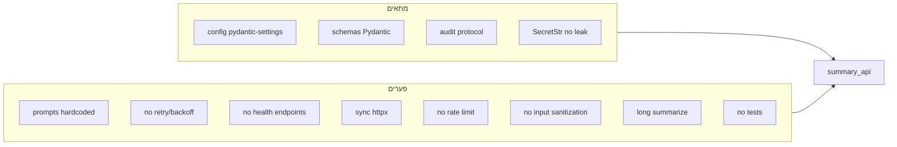

# מסמך פערים: קוד Summary API מול .cursor/rules

מסמך זה מסכם פערים בין הקוד ב-[summary_api/](summary_api/) (ויתר הפרויקט) לבין הכללים ב-[.cursor/rules/](.cursor/rules/) – בקטגוריות **configuration**, **core**, **infrastructure**, ובנוסף כללים רלוונטיים מ-**api**, **data**, **security**, **development**.

---

## 1. Configuration Rules

### 1.1 configuration-and-dependency-injection

| דרישה | סטטוס | פירוט |
|------|--------|------|
| **Pydantic Settings** | מתאים | [config.py](summary_api/config.py) משתמש ב-`pydantic-settings`, `SecretStr` למפתחות. |
| **Env vars, לא hardcode** | מתאים | מפתחות ונתיבים מ-`.env` דרך Settings. |
| **Validation ב-startup** | **פער** | אין Pydantic validators ל-Settings (למשל בדיקת פורמט API key, או path exists). |
| **Dependency Injection** | **פער חלקי** | פונקציות מקבלות `api_key`, `base_url` וכו' – אבל `get_settings()` מחזיר `Settings()` חדש בכל קריאה; אין העברת config/dependencies מהשכבה העליונה. |
| **Singleton ל-clients** | **פער** | אין Singleton ל-`OpenAIClient`/DB; ב-[github_client.py](summary_api/github_client.py) נוצר `httpx.Client()` חדש בכל `fetch_repo_files`, ב-[llm_client.py](summary_api/llm_client.py) נוצר client חדש בכל `_call_nebius`. |
| **Secrets – אין הדפסה בלי masking** | מתאים | שימוש ב-`SecretStr`; ב-main רק "set"/"not set" לוג. |

### 1.2 prompt-engineering-and-management

| דרישה | סטטוס | פירוט |
|------|--------|------|
| **Prompts לא hardcoded בלוגיקה** | **פער** | ב-[llm_client.py](summary_api/llm_client.py) – `SYSTEM_PROMPT` ו-`USER_PROMPT_TEMPLATE` מוגדרים כמחרוזות במודול. |
| **אחסון בקבצים/תיקייה ייעודית** | **פער** | אין תיקיית `prompts/` או קובץ prompts נפרד. |
| **Templating (Jinja2 / PromptTemplate)** | **פער חלקי** | משתמשים ב-`.format(context=context)` – לא Jinja2/LangChain PromptTemplate. |
| **XML-style tags בפרומפטים** | **פער** | אין שימוש ב-`<context>`, `<instructions>` וכו'. |
| **גרסת prompts / A/B / rollback** | **פער** | אין versioning, A/B או רישום גרסאות. |
| **בדיקות ל-prompts** | **פער** | אין unit tests ל-prompts. |
| **Token counting / truncation** | **פער חלקי** | ב-[repo_processor.py](summary_api/repo_processor.py) יש הגבלת תווים (`max_chars`), אבל אין הערכת טוקנים לפני שליחה ל-LLM. |

---

## 2. Core Rules

### 2.1 core-python-standards

| דרישה | סטטוס | פירוט |
|------|--------|------|
| **תכנון מודולרי** | מתאים | פיצול ל-main, config, github_client, llm_client, repo_processor, audit, schemas. |
| **שמות ברורים, type hints** | מתאים | רוב הקוד עם type hints; שמות ברורים. |
| **`from __future__ import annotations`** | **פער חלקי** | קיים ב-audit, repo_processor, llm_client, github_client; חסר ב-[main.py](summary_api/main.py), [config.py](summary_api/config.py), [schemas.py](summary_api/schemas.py). |
| **פונקציות עד 20 שורות** | **פער** | `summarize()` ב-[main.py](summary_api/main.py) ארוכה משמעותית (כ־120+ שורות); יש לפצל ל-helpers. |
| **I/O bound – asyncio, לא blocking** | **פער** | [github_client.py](summary_api/github_client.py) ו-[llm_client.py](summary_api/llm_client.py) משתמשים ב-`httpx.Client()` סינכרוני; הכלל דורש `async`/`await` ו-httpx async ב-loop הראשי. |
| **ללא `print()`** | מתאים | משתמשים ב-logging. |
| **Structured logging (JSON ב-prod)** | **פער חלקי** | יש logging אבל לא מוגדר JSON formatter מרוכז; audit כותב JSON ל-AUDIT.jsonl. |
| **Docstrings מלאים (Why, What, Args, Returns, Raises)** | **פער חלקי** | בחלק מהפונקציות יש docstrings טובים (למשל github_client, audit); בחלק (למשל פונקציות עזר ב-main) חסרים או לא מלאים. |

### 2.2 error-handling-and-resilience

| דרישה | סטטוס | פירוט |
|------|--------|------|
| **סיווג Transient vs Permanent** | **פער חלקי** | מיפוי 429/503 ב-main ל-status codes; אין סיווג מפורש (typed exceptions או error codes) לכל שגיאה. |
| **Retry עם exponential backoff + jitter** | **פער** | אין retry; אין שימוש ב-Tenacity או לוגיקה דומה. |
| **Circuit Breaker** | **פער** | אין circuit breaker ל-GitHub או ל-LLM API. |
| **Dead Letter Queue** | **פער** | אין DLQ ל-requests שנכשלו אחרי retries. |
| **Structured error logging (JSON, correlation_id, וכו')** | **פער חלקי** | audit_step כותב error_detail; לא כל הלוגים כוללים correlation_id ו-structured fields אחידים. |
| **אין לוג של secrets** | מתאים | אין הדפסת מפתחות. |

---

## 3. Infrastructure Rules

### 3.1 monitoring-and-observability

| דרישה | סטטוס | פירוט |
|------|--------|------|
| **Prometheus/StatsD metrics** | **פער** | אין איסוף מטריקות (request rate, error rate, latency). |
| **OpenTelemetry / distributed tracing** | **פער** | אין spans, אין instrumentation ל-FastAPI/httpx. |
| **כל log עם timestamp, correlation_id, operation_name** | **פער חלקי** | audit כולל timestamp ו-correlation_id; לוגים רגילים ב-main/llm_client לא תמיד מובנים כ-JSON עם שדות חובה. |
| **duration_ms ו-stage/total latency** | **פער חלקי** | duration_ms נמדד ונשלח ל-log_audit_step; אין PerformanceTimer מרוכז, אין `stage_latency_ms`/`total_latency_ms` בכל הלוגים. |
| **Health endpoints** | **פער** | אין `/health/live`, `/health/ready`, `/health/startup`. |
| **SLI/SLO / alerting** | **פער** | לא מוגדרים. |

### 3.2 rate-limiting-and-queue-management

| דרישה | סטטוס | פירוט |
|------|--------|------|
| **Rate limiting על ה-API** | **פער** | אין rate limiting על POST /summarize (לא per-IP, לא per-user, לא token bucket). |
| **טיפול ב-429 מ-GitHub/LLM** | **פער חלקי** | מחזירים 503/429 ללקוח; אין retry עם backoff, אין queue. |
| **כותרות rate limit בתשובה** | **פער** | אין X-RateLimit-*, Retry-After. |
| **תור / Redis / multi-key** | **פער** | לא רלוונטי כרגע למורכבות הפרויקט; הכלל מדבר על מערכות multi-agent. |

### 3.3 performance-optimization

| דרישה | סטטוס | פירוט |
|------|--------|------|
| **Connection pooling (HTTP/DB)** | **פער** | כל קריאה יוצרת `httpx.Client()` חדש; אין reuse. |
| **Caching (Redis / in-memory)** | **פער** | אין cache לתוצאות summarize או ל-GitHub responses. |
| **Semantic caching (Vector DB)** | **פער** | לא מיושם (הכלל רלוונטי למערכות agentic עם שאילתות חוזרות). |

### 3.4 multi-tenancy-and-isolation

| דרישה | סטטוס | פירוט |
|------|--------|------|
| **Tenant isolation / tenant_id** | לא רלוונטי | ה-API לא multi-tenant; audit כותב `tenant_id: null`. אין פער אם אין דרישת multi-tenancy. |

### 3.5 deployment-and-infrastructure

| דרישה | סטטוס | פירוט |
|------|--------|------|
| **CI/CD (lint, test, build, deploy)** | **פער** | אין תיקיית `.github/workflows` או pipeline אחר. |
| **Docker (multi-stage, non-root, pin versions)** | **פער** | אין Dockerfile. |
| **Kubernetes / health probes** | **פער** | לא רלוונטי כרגע; חסרים health endpoints. |
| **אין deploy ישיר ל-prod בלי pipeline** | **פער** | אין pipeline בכלל. |

---

## 4. API Rules (רלוונטי ל-summary_api)

### 4.1 api-interface-and-streaming

| דרישה | סטטוס | פירוט |
|------|--------|------|
| **Streaming (SSE/WebSocket) ל-agent endpoints** | **פער** | POST /summarize מחזיר JSON בלבד; אין token streaming. (הכלל ממוקד ב-"Agentic Endpoints" – אם מגדירים את זה כ-batch-style, הפער תלוי בהחלטה.) |
| **FastAPI + async generators** | **פער** | ה-endpoint סינכרוני; אין `async def` עם yield. |

### 4.2 api-documentation-standards

| דרישה | סטטוס | פירוט |
|------|--------|------|
| **OpenAPI 3.0** | מתאים חלקית | FastAPI מייצר schema; `/docs` קיים. |
| **גרסת API ב-URL** | **פער** | אין `/api/v1/`; הנתיב הוא `/summarize` ולא `/api/v1/summarize`. |
| **תיעוד מלא (דוגמאות, error responses)** | **פער חלקי** | יש response_model; ניתן להוסיף examples ו-response codes מפורשים בתיעוד. |

---

## 5. Data Rules

### 5.1 data-schemas-and-interfaces

| דרישה | סטטוס | פירוט |
|------|--------|------|
| **Pydantic ל-API boundary** | מתאים | [schemas.py](summary_api/schemas.py) – SummarizeRequest, SummarizeResponse, ErrorResponse. |
| **Field(description=...) לכל שדה** | מתאים | קיים ב-schemas. |
| **Literal לערכים סופיים** | מתאים | `status: Literal["error"]` ב-ErrorResponse. |
| **dataclass פנימי** | מתאים | `RepoFile` ב-github_client כ-dataclass מתאים להגדרת הכלל למבנים פנימיים. |

---

## 6. Security Rules (רלוונטי)

### 6.1 audit-protocol

| דרישה | סטטוס | פירוט |
|------|--------|------|
| **API requests logged** | מתאים | [audit.py](summary_api/audit.py) + קריאות מ-main. |
| **מבנה audit (timestamp, event_type, correlation_id, וכו')** | מתאים | שדות חובה קיימים. |
| **Immutable, append-only, hash** | מתאים | log_hash, כתיבה append. |
| **execution_step ל-Judge** | מתאים | log_audit_step עם input/output/error/duration. |

### 6.2 prompt-injection-prevention

| דרישה | סטטוס | פירוט |
|------|--------|------|
| **Sanitization של user input לפני כניסה לפרומפט** | **פער** | `request.github_url` ו-context (תוכן קבצים) נכנסים לפרומפט בלי sanitization/escaping או זיהוי injection. |
| **Injection detection (pattern/heuristic)** | **פער** | לא מיושם. |

---

## 7. Development Rules

### 7.1 tests-and-validation

| דרישה | סטטוס | פירוט |
|------|--------|------|
| **תיקיית tests/** | **פער** | אין תיקיית `tests/` ואין קבצי `test_*.py`. |
| **pytest** | **פער** | pytest ב-requirements אבל אין טסטים. |
| **קבצים קטנים test_<component>.py** | **פער** | אין. |
| **Mock ל-APIs חיצוניים** | **פער** | אין טסטים. |

### 7.2 versioning-and-release-management

לא נבדק לעומק; אין כנראה CHANGELOG או גרסת API מסודרת – יכול להיכלל במסמך כהערה.

---

## 8. סיכום פערים לפי עדיפות

**גבוהה (תאימות לכללים "Always Apply" ו-security):**
- פיצול פונקציית `summarize()` (core-python-standards).
- הוספת retry עם exponential backoff ל-GitHub ו-LLM (error-handling).
- הוספת input sanitization ו-injection detection לפני כניסת תוכן לפרומפט (prompt-injection-prevention).
- `from __future__ import annotations` בכל המודולים (core-python-standards).

**בינונית (תשתית ו-configuration):**
- העברת prompts לקבצים/תיקייה ייעודית + templating (prompt-engineering).
- Validation ב-Settings (config).
- Singleton/pool ל-httpx (או async clients) (config + performance).
- Health endpoints: `/health/live`, `/health/ready` (monitoring).
- Structured logging עם timestamp, correlation_id, duration בכל הלוגים (monitoring).
- Rate limiting על ה-API (rate-limiting / api-interface).

**נמוכה / אופציונלית:**
- OpenTelemetry, Prometheus, PerformanceTimer (monitoring).
- CI/CD, Dockerfile (deployment).
- API versioning `/api/v1/` (api-documentation).
- Streaming ל-summarize (api-interface – תלוי product).
- Circuit breaker, DLQ (error-handling – תלוי scale).
- תיקיית tests + pytest (tests-and-validation).

---

## 9. דיאגרמה – התאמה לכללים

