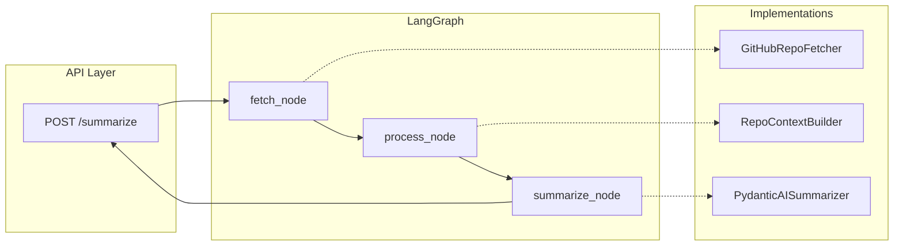

# Summary API — Codebase Summary

This document describes the Summary API codebase: what it does, how orchestration works, the role of each file, the main algorithms, what was added versus existing, and a detailed account of every external library and its role in each file.

---

## 1. Overview

**Summary API** is a service that accepts a public GitHub repository URL, fetches the repository’s file list and contents, builds a single context string (filtered and prioritized), and sends it to an LLM (Nebius Token Factory) to produce a structured summary: short description, list of technologies, and repository structure.

Orchestration is implemented with **LangGraph**: a linear graph of three nodes — **fetch → process → summarize**. Shared state is a `TypedDict`; each node reads from state, runs its step, and returns updates. The API layer builds initial state, invokes the compiled graph, and returns either an error response or the summary.

---

## 2. Orchestration Flow



**Entry point:** `summary_api/api/main.py` — `POST /summarize` builds `initial_state` (e.g. `correlation_id`, `github_url`, tokens, paths), then calls `get_summarize_graph().ainvoke(initial_state)`.

**Graph:** `summary_api/workflows/graph.py` — Builds a `StateGraph(SummarizeState)` with three nodes and linear edges: `fetch_node` → `process_node` → `summarize_node`.

**State:** `summary_api/workflows/state.py` — `SummarizeState` (TypedDict) holds input (e.g. `github_url`, tokens, paths), outputs (`files`, `context`, `result`), and error fields (`errors`, `error_response`).

**Nodes:** `summary_api/workflows/nodes.py` — Each node: if `error_response` is already set, returns `{}` (skip). Otherwise it reads from state, calls the injected implementation (fetcher / processor / summarizer), writes audit; on exception it writes to DLQ and sets `error_response`. Factories: `make_fetch_node(fetcher)`, `make_process_node(processor)`, `make_summarize_node(summarizer)`; dependencies are injected from `graph.py`.

**Back to API:** After `ainvoke`, `main.py` checks `final_state` for `error_response` — if present, returns a `JSONResponse` with the appropriate status; otherwise builds `SummarizeResponse` from `result` and returns 200.

---

## 3. Role of Each File

### API

| File | Role |
|------|------|
| `summary_api/api/main.py` | FastAPI app: lifespan (HTTP client, logging), `POST /summarize` (build state, invoke graph, build response), health and root routes, validation exception handler. |

### Workflows (orchestration)

| File | Role |
|------|------|
| `summary_api/workflows/graph.py` | Builds and compiles the LangGraph: `StateGraph`, three nodes, entry point and edges. |
| `summary_api/workflows/state.py` | Defines `SummarizeState` (TypedDict) — all fields passed between nodes. |
| `summary_api/workflows/nodes.py` | Three factory functions: `make_fetch_node`, `make_process_node`, `make_summarize_node` — node logic, audit, DLQ, error mapping. |

### Contracts (swappable interfaces)

| File | Role |
|------|------|
| `summary_api/contracts/interfaces.py` | ABCs: `RepoFetcher`, `ContextBuilder`, `Summarizer` — contracts for fetch, build_context, summarize. |
| `summary_api/contracts/__init__.py` | Re-exports the interfaces. |

### Implementations

| File | Role |
|------|------|
| `summary_api/clients/github_fetcher_impl.py` | `GitHubRepoFetcher` — implements `RepoFetcher`, delegates to `fetch_repo_files`. |
| `summary_api/clients/github_client.py` | GitHub logic: URL parsing, Contents API recursion, `RepoFile`, `GitHubClientError`, retry and circuit breaker on `fetch_repo_files`. |
| `summary_api/services/repo_processor.py` | `RepoContextBuilder` and `process_repo_files`: filtering (skip dirs/patterns), prioritization (README/config), directory tree, truncation to `max_chars`. |
| `summary_api/services/summarizer.py` | `PydanticAISummarizer` — implements `Summarizer` with a PydanticAI Agent, prompt from `system.j2`, retry and circuit breaker. |

### Core and infrastructure

| File | Role |
|------|------|
| `summary_api/core/config.py` | Settings (pydantic-settings): NEBIUS_*, GITHUB_*, paths, limits; `get_settings`, `get_env_file_path`. |
| `summary_api/core/audit.py` | `log_audit`, `log_audit_step`, `error_detail_from_exception`; `get_session_context_for_judge` — append-only AUDIT.jsonl. |
| `summary_api/core/context_compression.py` | Token estimation (tiktoken/chars), `compress_context` (FIFO by section), `compress_context_if_needed` when over threshold. |
| `summary_api/core/scratchpad.py` | `append_scratchpad` — debug log to SCRATCHPAD.log (not sent to LLM). |
| `summary_api/infrastructure/dlq.py` | `write_to_dlq` — append failed requests to DLQ.jsonl. |

### Models and other clients

| File | Role |
|------|------|
| `summary_api/models/schemas.py` | Pydantic: `SummarizeRequest`, `SummarizeResponse`, `ErrorResponse`. |
| `summary_api/clients/llm_client.py` | Direct Nebius calls (chat/completions), Jinja prompts, JSON parsing — **not used in the current POST /summarize flow** (flow uses `PydanticAISummarizer`). |

### Prompts and tools

| File | Role |
|------|------|
| `summary_api/prompts/system.j2` | System prompt for PydanticAI: JSON format with summary, technologies, structure. |
| `summary_api/prompts/user.j2` | User prompt with `{{ context }}` — used by `llm_client`, not by the current PydanticAI summarizer. |
| `summary_api/tools/summarize.py` | LangChain `@tool` `summarize_repo_context` — uses `PydanticAISummarizer`; for use as a tool inside another agent, not from `POST /summarize`. |

---

## 4. Main Algorithms

1. **Fetch:** Parse GitHub URL → recursive Contents API → collect files (optional token, connection pooling). Retry on transient errors; circuit breaker after 5 failures.
2. **Process:** Filter (e.g. node_modules, lock files, minified); sort by priority (README/config at root first); build "Repository structure" and "Key files" sections; truncate to `max_context_chars`.
3. **Summarize:** Optionally compress context by `context_limit_tokens` (FIFO); call PydanticAI Agent with `system.j2`; normalize output to `SummarizeResponse`.
4. **Errors:** Each node on exception writes audit and, where relevant, DLQ, and sets `error_response`; subsequent nodes are skipped; the API returns the appropriate status (400, 401, 404, 429, 502, 503).

---

## 5. What Was Added vs Existing

From git status:

- **New (untracked):** `summary_api/contracts/`, `summary_api/core/context_compression.py`, `summary_api/core/scratchpad.py`, `summary_api/services/summarizer.py`, `summary_api/clients/github_fetcher_impl.py`, `summary_api/tools/`, `summary_api/workflows/` (state, nodes, graph).
- **Modified:** `summary_api/api/main.py`, `summary_api/clients/github_client.py`, `summary_api/core/config.py`, `summary_api/services/repo_processor.py` — wired to LangGraph, contracts, context compression, DLQ/audit.

So: orchestration (workflows), contracts, PydanticAI-based summarizer, fetcher as a separate implementation, context compression, and scratchpad are the main additions; the API and clients were changed to plug them in.

---

## 6. Libraries and Their Role per File

Below, for each file that uses third-party or standard-library packages, every such package is listed with a clear explanation of **how it is used in that file**. The same library may appear in multiple files with different roles.

**Project dependencies (from `pyproject.toml`):** fastapi, uvicorn, pydantic-settings, httpx, pytest, python-dotenv, tenacity, circuitbreaker, jinja2, langgraph, pydantic-ai, openai. **Standard library** usage (e.g. json, logging, re, typing, pathlib, datetime, hashlib, traceback, os, contextlib, uuid, time, abc, dataclasses, importlib.resources) is also documented where relevant. **langchain_core** appears in `tools/summarize.py` (typically as a transitive dependency of langgraph).

---

### summary_api/api/main.py

- **fastapi** (FastAPI, Request, Response, RequestValidationError, JSONResponse): Web framework — `FastAPI()` for the app, lifespan, route decorators for `POST /summarize`, health, and root; `Request` and `Response` for app state (e.g. `request.app.state.http_client`) and response headers; `RequestValidationError` for request-body validation errors; `JSONResponse` for JSON error and health responses with the right status code.
- **httpx**: A single `httpx.AsyncClient` is created in the lifespan with connection pooling (`max_keepalive_connections`, `max_connections`), stored on `app.state.http_client`, and passed into the workflow so that GitHub and LLM calls can share the same pool; the client is closed with `aclose()` on shutdown.
- **json**: In `_JsonFormatter`, log records are turned into a dict (timestamp, level, message, logger, correlation_id, operation_name) and serialized with `json.dumps` for structured JSON logging (e.g. for Splunk).
- **logging**: Logger setup, level for `summary_api.clients.llm_client`, JSON formatter when `LOG_FORMAT=json`, and `logger.info` when building the success response (summary/structure lengths) and in lifespan (env path and NEBIUS_API_KEY status).
- **time**: `time.strftime` in `_JsonFormatter` for log timestamps; `time.monotonic()` in `health_ready` to implement a short cache interval (about 5 seconds) for the readiness check.
- **uuid**: `uuid.uuid4()` is used to generate a unique `correlation_id` for each `POST /summarize` request; this ID is used in audit, DLQ, and the `X-Correlation-ID` response header.
- **contextlib.asynccontextmanager**: Decorator for `_lifespan` as an async context manager: setup (logging, HTTP client) on startup, `yield`, and close of the client in `finally` on shutdown.

---

### summary_api/workflows/graph.py

- **langgraph** (StateGraph, CompiledStateGraph): `StateGraph(SummarizeState)` defines the workflow graph and its state type; `add_node` registers the three nodes (fetch, process, summarize); `set_entry_point` and `add_edge` define the linear flow; `compile()` returns a `CompiledStateGraph` that supports `ainvoke(initial_state)` from the API layer.

---

### summary_api/workflows/state.py

- **typing** (Any, TypedDict): `TypedDict` defines `SummarizeState` — the shared state shape for all nodes (inputs, outputs, errors); `total=False` makes every field optional; `Any` is used for generic dict fields (e.g. `errors`, `result`, `error_response`, `http_client`).

---

### summary_api/workflows/nodes.py

- **time**: Each node measures duration with `time.perf_counter()` at the start and the difference at the end to compute `duration_ms` for `log_audit_step`.
- **datetime** (datetime, timezone): UTC timestamps for audit — `datetime.now(timezone.utc).isoformat()` for `start_time` and `end_time` in each node.
- **typing** (Any): Type hints for dicts (e.g. node return value, `error_response`, `errors`, `result`) and for `error_detail`.
- **circuitbreaker** (CircuitBreakerError): Imported as an exception type — in the fetch and summarize nodes, when the circuit is open after repeated failures (GitHub or LLM), the code catches `CircuitBreakerError`, logs audit and DLQ, and returns 503 "Service temporarily unavailable". The actual retry and circuit logic lives in the clients/summarizer; the nodes only handle the raised exception.
- All other imports are from the project (contracts, core, infrastructure, models, services), not external libraries.

---

### summary_api/contracts/interfaces.py

- **abc** (ABC, abstractmethod): Used to define abstract contracts — `RepoFetcher`, `ContextBuilder`, and `Summarizer` inherit from `ABC`; their main methods are marked with `@abstractmethod` so there is no default implementation and concrete classes must implement the exact signatures.
- **typing** (Sequence): The `files` parameter in `ContextBuilder.build_context` is typed as `Sequence[RepoFile]`, so callers can pass any sequence (e.g. list or tuple) without tying the interface to a concrete list type.
- **httpx**: The `client` parameter in `RepoFetcher.fetch` is typed as `httpx.AsyncClient | None`; the contract specifies that when a client is provided (e.g. from the API), it should be used for connection pooling.

---

### summary_api/services/summarizer.py

- **importlib.resources** (files): Loads the system prompt from the package — `files("summary_api.prompts").joinpath("system.j2").read_text(encoding="utf-8")` — so the template is loaded as part of the package without assuming filesystem paths.
- **circuitbreaker** (circuit): The `@circuit` decorator on `_run_with_resilience` implements a circuit breaker: after 5 failures (of type `LLMClientError`), the circuit opens and further calls fail immediately for 60 seconds before a half-open attempt; this avoids hammering the LLM when it is unhealthy.
- **openai** (AsyncOpenAI): Builds an OpenAI-compatible API client — `AsyncOpenAI(api_key=..., base_url=..., timeout=...)`. Nebius exposes an OpenAI-compatible endpoint, so this client is used via PydanticAI’s `OpenAIProvider`.
- **pydantic_ai** (Agent, OpenAIChatModel, OpenAIProvider): An `Agent` is created with `output_type=SummarizeResponse`; the agent calls the LLM with the system prompt and returns a validated Pydantic object. `OpenAIChatModel` and `OpenAIProvider` connect the agent to the AsyncOpenAI client (Nebius).
- **tenacity** (retry, retry_if_exception, stop_after_attempt, wait_random_exponential): The `@retry` decorator on `_run_with_resilience` retries only on exceptions that are considered transient (`_is_llm_transient`); up to 3 attempts with exponential backoff (1–60 seconds) and jitter to reduce load on the API when hitting rate limits or 5xx errors.

---

### summary_api/services/repo_processor.py

- **re**: Regular expressions — `re.compile` for `SKIP_FILE_PATTERNS` (lock files, minified, map, etc.) and for `PRIORITY_README` and `PRIORITY_LICENSE`; `pat.search(base)` in `should_skip_path` and `PRIORITY_README.match(base)` in `_file_priority` to filter and order files.

---

### summary_api/clients/github_client.py

- **re**: URL parsing — `re.match` on the GitHub URL to extract `owner` and `repo` with a pattern like `https?://(?:www\.)?github\.com/...`; also used to validate that the string looks like a valid repo URL.
- **dataclasses** (dataclass): `RepoFile` is defined as a dataclass with `path` and `content` — a simple, immutable structure that is passed from the fetch step to the process step.
- **httpx**: All HTTP calls — `client.get(url, ...)` to the GitHub Contents API; handling of `HTTPStatusError`, `TimeoutException`, and `RequestError` and conversion to `GitHubClientError`; support for an external `AsyncClient` (connection pooling) or creation of a new client when none is passed.
- **circuitbreaker** (circuit): The `@circuit` decorator on `fetch_repo_files` opens the circuit after 5 failures (of type `GitHubClientError`); for 60 seconds, calls fail immediately with `CircuitBreakerError`.
- **tenacity** (retry, retry_if_exception, stop_after_attempt, wait_random_exponential): Retries only on `GitHubClientError` with `is_transient=True` (e.g. rate limit, timeout, 5xx); up to 3 attempts with exponential backoff and jitter.

---

### summary_api/clients/github_fetcher_impl.py

- **httpx**: Used only in type hints — the `fetch` method signature accepts `client: httpx.AsyncClient | None`; the implementation passes this client through to `fetch_repo_files` in `github_client`, where the actual HTTP calls are made.

---

### summary_api/clients/llm_client.py

- **json**: Parsing the LLM response — `response.json()`; extracting JSON from markdown in `_extract_json_text` and `json.loads` in `_parse_structured_response`; building the `/chat/completions` payload and using `json.dumps` for logging.
- **logging**: A module logger for detailed logging of messages sent to the LLM and for a warning when the response is truncated (`finish_reason=length`).
- **re**: `re.search` in `_extract_json_text` to extract content from a ```json ... ``` block in the LLM response.
- **importlib.resources** (files): Loads Jinja templates — `files("summary_api.prompts")` and then reading `system.j2` and `user.j2` for rendering prompts.
- **httpx**: HTTP calls to Nebius — `client.post(url, json=payload, headers=headers, timeout=timeout)` to `/chat/completions`; supports an external AsyncClient or creates a new one; catches `TimeoutException` and `NetworkError` and converts them to `LLMClientError`.
- **circuitbreaker** (circuit): The `@circuit` decorator on `summarize_repo` — same idea as in the summarizer (5 failures, 60s recovery).
- **jinja2** (Template): Renders the system and user prompt templates with `Template(...).render()` and `context` as the placeholder.
- **tenacity**: Retry on `summarize_repo` for transient errors (429, 5xx, timeout, network), same pattern as in the summarizer.

**Note:** `llm_client` is not used in the current `POST /summarize` flow; that flow uses `PydanticAISummarizer`. This module remains available for direct LLM calls or other entry points.

---

### summary_api/core/config.py

- **pathlib** (Path): Path resolution — `Path(__file__).resolve().parent.parent.parent` to find the project root and `_ENV_FILE`; default paths for `AUDIT.jsonl` and `DLQ.jsonl` under the project root; `get_env_file_path()` returns a `Path`.
- **pydantic** (SecretStr, field_validator): `SecretStr` for `NEBIUS_API_KEY` and `GITHUB_TOKEN` so values are not printed in repr or logs; `field_validator` for validations such as: API key must not be only whitespace when set, default paths when empty, and positive values for numeric settings.
- **pydantic_settings** (BaseSettings, SettingsConfigDict): Loads configuration from the environment and `.env` — `BaseSettings` with `env_file`, `env_file_encoding`, and `extra="ignore"`; all fields (NEBIUS_*, GITHUB_*, paths, limits) are loaded and validated automatically.

---

### summary_api/core/audit.py

- **hashlib**: SHA-256 of the audit entry — `hashlib.sha256(line_bytes).hexdigest()` over the JSON line bytes before adding `log_hash` to the entry; supports the "Immutable Logs" requirement with a hash for integrity.
- **json**: Serialization — `json.dumps(entry, ensure_ascii=False)` to write one JSON line per event; `json.loads(line)` in `_read_audit_entries_by_correlation` to read AUDIT.jsonl and filter by correlation_id.
- **os**: `os.path.isfile(path)` in `get_session_context_for_judge` to check that the audit file exists before reading.
- **traceback**: `traceback.format_exception(...)` in `error_detail_from_exception` to produce a string representation of the traceback for the error_detail dict used in audit and DLQ.
- **datetime** (datetime, timezone): `datetime.now(timezone.utc).isoformat()` for the `timestamp` field in every audit entry.
- **typing** (Any): Type hints for metadata, error_detail, execution_logs, and other generic dicts.

---

### summary_api/core/context_compression.py

- **logging**: A module logger for any logging around compression and threshold warnings.
- **re**: `re.split(r"(?=\n### )", key_files_part)` in `_sections_from_key_files` to split the context into sections by `### path` headers so that FIFO compression can drop sections from the end.
- **tiktoken** (optional): In `estimate_tokens`, when available, `tiktoken.get_encoding("cl100k_base").encode(text)` is used for accurate token counts; if the import fails, the code falls back to `len(text) // 4`.

---

### summary_api/core/scratchpad.py

- **logging**: `_logger.warning` when writing to the scratchpad file fails (e.g. permissions).
- **datetime** (datetime, timezone): `datetime.now(timezone.utc).isoformat()` for the timestamp on each scratchpad line.
- **pathlib** (Path): `Path(scratchpad_path)` and `path.open("a", ...)` for resolving the path and appending to the log file.

---

### summary_api/infrastructure/dlq.py

- **json**: `json.dumps(entry, ensure_ascii=False)` to form a single JSON line per DLQ entry before writing to the file.
- **datetime** (datetime, timezone): `datetime.now(timezone.utc).isoformat()` for the `timestamp` field in each DLQ entry.

---

### summary_api/models/schemas.py

- **typing** (Literal): `Literal["error"]` for the `status` field in `ErrorResponse` — a fixed value for the error response shape.
- **pydantic** (BaseModel, Field, field_validator): `BaseModel` for `SummarizeRequest`, `SummarizeResponse`, and `ErrorResponse`; `Field` for descriptions and validation; `field_validator` for `github_url` (required, non-empty) and any other validators.

---

### summary_api/tools/summarize.py

- **langchain_core.tools** (tool): The `@tool` decorator on `summarize_repo_context` turns it into a LangChain tool that can be passed to an agent; the docstring and parameters are used by the agent’s LLM to choose the tool and fill in arguments. (langchain_core is typically pulled in as a transitive dependency of langgraph.)

---

## Appendix: Project Dependencies (pyproject.toml)

| Package | Role in the project |
|---------|----------------------|
| fastapi | Web framework for the Summary API (routes, lifespan, validation). |
| uvicorn | ASGI server to run the FastAPI app (dev and production). |
| pydantic-settings | Loads and validates configuration from environment and .env. |
| httpx | Async HTTP client for GitHub API and Nebius LLM; connection pooling. |
| pytest | Test runner for the test suite. |
| python-dotenv | Loads .env (often used indirectly via pydantic-settings). |
| tenacity | Retry with backoff for transient failures (GitHub and LLM). |
| circuitbreaker | Stops calling a failing service after a threshold (GitHub and LLM). |
| jinja2 | Renders prompt templates (used in llm_client). |
| langgraph | Defines and compiles the fetch → process → summarize workflow graph. |
| pydantic-ai | Agent framework for the summarizer (structured output, system prompt). |
| openai | OpenAI-compatible client used by PydanticAI to call Nebius. |
